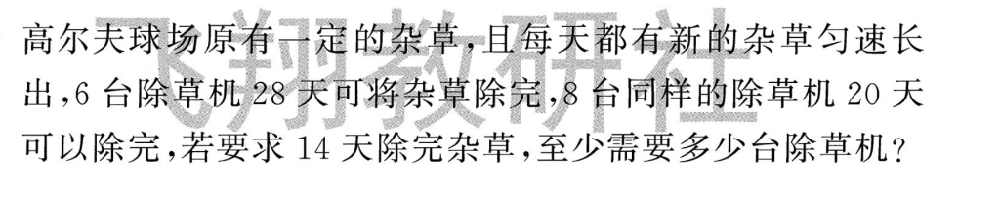

# 牛吃草问题（边消耗边增长）

## 1. 原题与错题重现

高尔夫球场原有一定的杂草，且每天都有新的杂草匀速长出，6台除草机28天可将杂草除完，8台同样的除草机20天可以除完，若要求14天除完杂草，至少需要多少台除草机？

## 2. 错因分析
* 核心错因：**[M2] 逻辑断层**。萌萌虽然知道是“牛吃草”题型，但在建立“初始量+增长量=总消耗量”的等量关系时，逻辑转化出现断层，无法熟练联立方程序。

## 3. 正确解析 (SOP)
* 解题题眼：**【求出变量，锁定守恒】**。牛吃草问题的核心是先求出“草的生长速度”和“原有草量”。
* 正确过程：
    1. 设1台除草机1天的工作量为1。
    2. 计算草的生长速度：(6 * 28 - 8 * 20) / (28 - 20) = 1。
    3. 计算原有草量：6 * 28 - 28 * 1 = 140。
    4. 计算14天所需除草机台数：(140 + 14 * 1) / 14 = 11（台）。

## 4. 本质分析

### 一句话快速概括
> 牛吃草 = **边长边吃**：先求 **每天增长量** 和 **原有量**，再算目标天数要多少台。

### 展开分析
1. **两未知**：草每天长多少、原来有多少草。
2. **求生长速度**：(6×28 − 8×20) ÷ (28−20) = 1。
3. **求原草量**：6×28 − 28×1 = 140；再代入 14 天求台数。