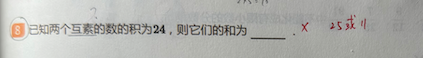

# 两互素数积为24求和（25或11）

## 1. 原题 with 错题重现

8. 已知两个**互素**的数的积为 24，则它们的和为 ______ 。

（学生未作答；标准答案：**25 或 11**）

## 2. 错因分析
* 核心错因：**[M1] 认知盲区**。学生反馈**不知道「互素」是什么意思**（易与「素数」混称），概念未建立，导致无法启动因数列举与筛选；卷面未作答。
* 能力卡点：互素 ≠ 任意两个数；须从因数对中排除有公因数的组合（如 2 与 12、4 与 6）。

### 概念补洞（[M1] 必填）
* **素数（质数）**：大于 1 的自然数，**只能**被 1 和它自己整除。例如：2、3、5、7、11…（24 不是素数，因为 24=4×6）。
* **互素（互质）**：指**两个数**之间的关系——除了 1 以外，**没有别的公因数**。判法：求最大公因数 **GCD**，若 **GCD=1** 则互素。
  * 例：(3, 8) 互素——8 的因数 1,2,4,8，与 3 除 1 外无共有因数。
  * 反例：(2, 12) 不互素——都有因数 2。
* **本题在考什么**：在「积 = 24」的所有正整数因数对里，**只留下互素的那几对**，再分别算和。

## 3. 正确解析 (SOP)
* 解题题眼：**【先列积为 24 的整数对 → 再判互素 → 分别求和 → 答案写全】**。
* 正确过程：
  1. 列出积为 24 的正整数对：(1, 24)，(2, 12)，(3, 8)，(4, 6)。
  2. 判互素（除 1 外无公因数）：
     - (1, 24)：互素 → 和 = 1 + 24 = **25**
     - (2, 12)：不互素（公因数 2）
     - (3, 8)：互素 → 和 = 3 + 8 = **11**
     - (4, 6)：不互素（公因数 2）
  3. 答：**25 或 11**（两解都要写）。

## 4. 本质分析

### 一句话快速概括
> 这题关键字是 **互素**——两个数「除了 1 没有别的公约数」；先列出积是 24 的数对，再筛互素，最后算和。

### 展开分析
1. **互素 ≠ 素数**：素数是「只能被 1 和自己整除」的单个数；互素是「两个数除了 1 没有公因数」——本题考的是后者。
2. **固定三步**：列因数对 → 判互素（踢掉 2&12、4&6）→ 分别相加。
3. **易漏点**：有两组互素解，答案要写全 **25 或 11**，不能只写一个。