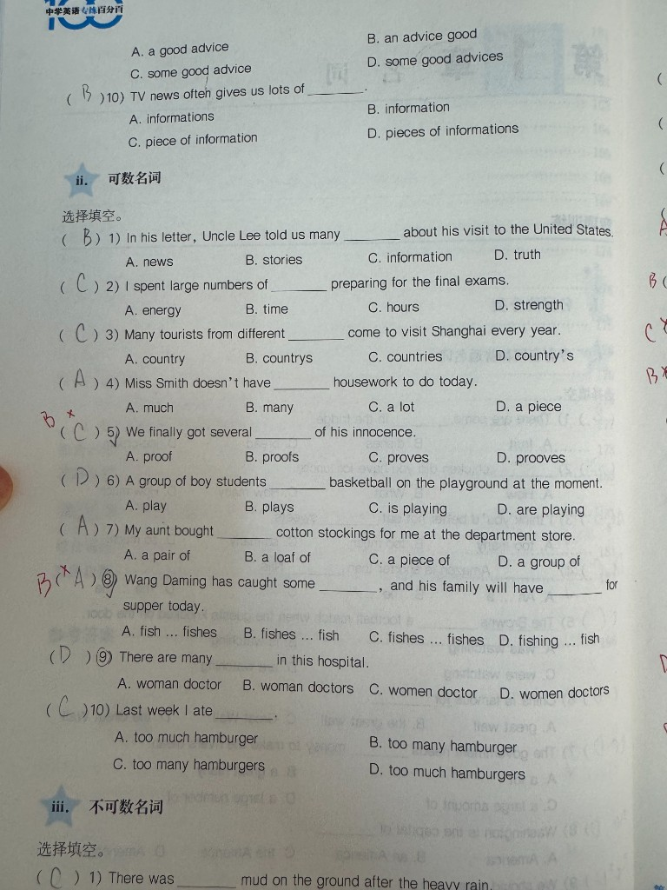

# （卷面第9题）some good advice 不可数

## 1. 原题 with 错题重现

**卷面第 9 题**（题干见下图第 1 页；**选项在连续页顶部**，见下图第 2 页）

9) We should take ______.

A. a good advice　B. an advice good　C. some good advice　D. some good advices

**学生作答：** D ✗　**正确答案：** C

## 2. 错因分析
* 核心错因：**[E2] 语法**。**advice** 不可数，无复数 **advices**；不可说 **a good advice**，应用 **some good advice**。

## 3. 正确解析 (SOP)
* 解题题眼：**【advice 不可数 → some / a piece of；无 advices】**。
* 正确过程：
  1. **advice**（建议）不可数，不能说 an advice / advices。
  2. 正确搭配：**some advice**、**a piece of advice**、**some good advice**。
  3. B 项词序错误；D 项 advices 不存在。
  4. 选 **C**。

## 4. 本质分析

### 一句话快速概括
> **advice 不可数**：用 **some good advice**，没有 advices，也没有 a good advice。

### 展开分析
1. **语法**：不可数名词不能加 -s，也不能用 a/an 直接修饰（需 a piece of）。
2. **易错**：与 suggestion（可数）混淆， suggestion 可有复数 suggestions。