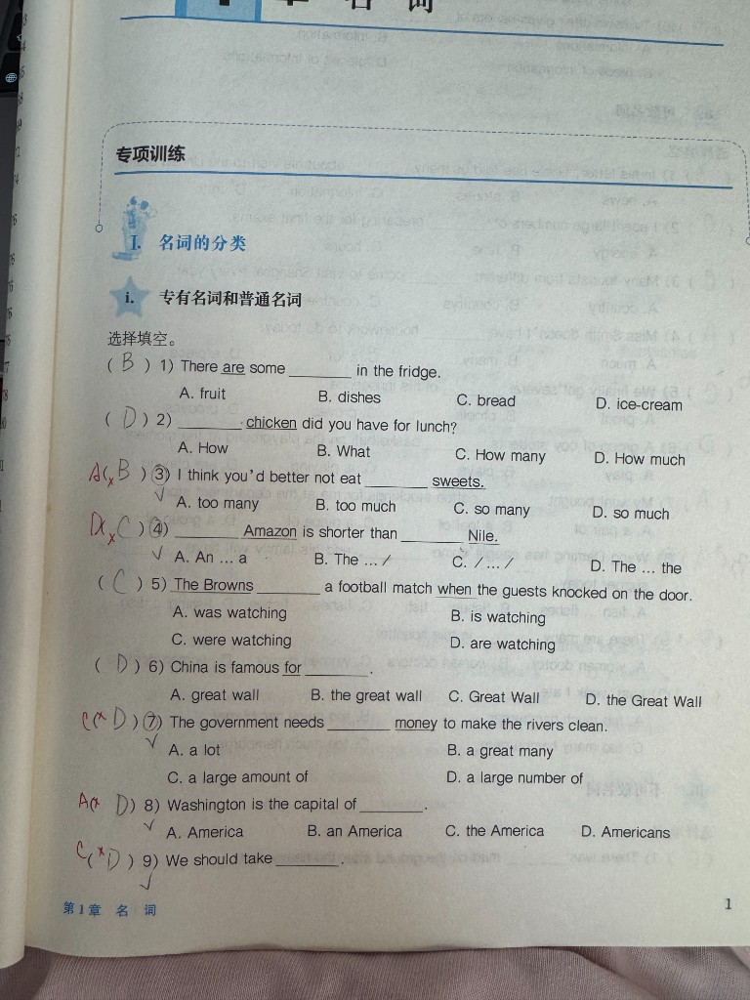

# （卷面第3题）sweets 用 too many 不用 too much

## 1. 原题 with 错题重现

**卷面第 3 题（专项训练 i · 选择填空）**

3) I think you'd better not eat ______ sweets.

A. too many　B. too much　C. so many　D. so much

**学生作答：** B ✗　**正确答案：** A

## 2. 错因分析
* 核心错因：**[E2] 语法**。把可数名词 **sweets** 当成不可数，误选 **too much**；应配 **too many**。

## 3. 正确解析 (SOP)
* 解题题眼：**【先判可数/不可数 → many 可数，much 不可数】**。
* 正确过程：
  1. **sweet** 作「糖果」时常用复数 **sweets**，可数。
  2. **too many + 可数名词复数**；**too much + 不可数名词**。
  3. 选 **A. too many**。

## 4. 本质分析

### 一句话快速概括
> **sweets 可数** → 用 **too many**，不能用 too much。

### 展开分析
1. **语法**：many/much 的选择由名词可数性决定，不是凭语感。
2. **词汇**：sweet 当糖果讲常用复数 sweets。
3. **易错**：看到「少吃」就选 much，要先圈出名词是否可数。